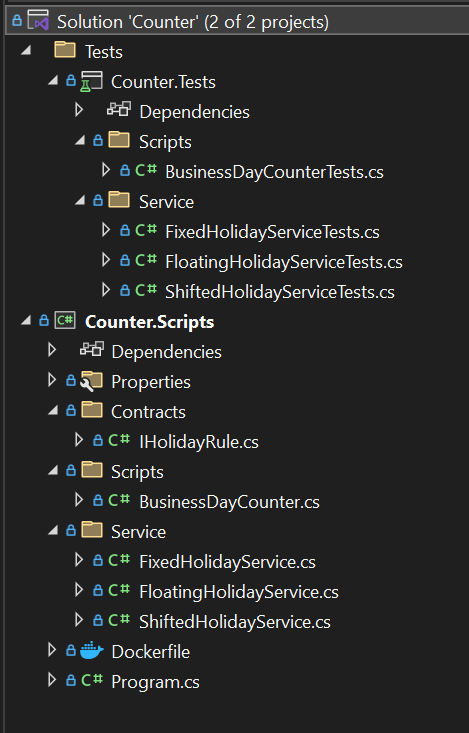

# BusinessDayCounter Project

This repository contains a solution to calculate weekdays and business days between two dates, accounting for public holidays. It includes a **BusinessDayCounter** class with methods for calculating:
1. **WeekdaysBetweenTwoDates**: Calculates weekdays (Monday to Friday) between two dates.
2. **BusinessDaysBetweenTwoDates**: Calculates business days between two dates, excluding public holidays.

## Design Principle

This project follows the **Separation of Concerns (SoC)** and  **Dependency Injection(DI)** principle. The **BusinessDayCounter** class handles two distinct responsibilities:
- Counting weekdays between two dates.
- Counting business days between two dates, excluding public holidays.

## System Requirement
To run the project. you could rn it using
- Net Version 8.0
or 
- You could run the project using docker 

## Project Structure



## Testing
```
dotnet test
```
## Run the Project
```
dotnet run build
```
